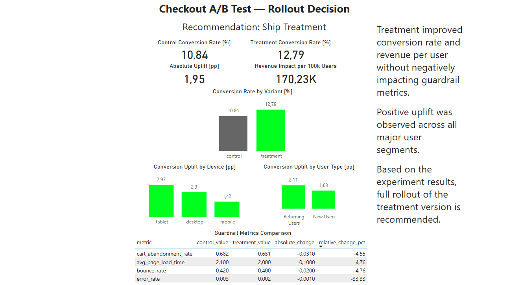
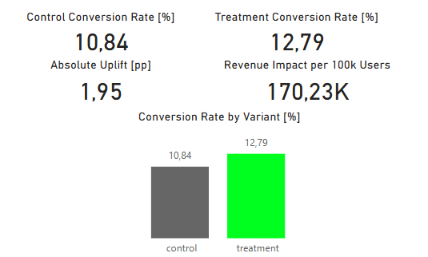

# Checkout A/B Test Analysis

## Opis projektu

Projekt przedstawia kompleksową analizę testu A/B dla hipotetycznego redesignu procesu checkout w ecommerce.

Celem eksperymentu było sprawdzenie, czy nowa wersja checkoutu („treatment”) poprawia wyniki biznesowe względem obecnego rozwiązania („control”).

Projekt został zbudowany jako end-to-end case study z obszaru Product Analytics / Data Analytics z wykorzystaniem:

- PostgreSQL
- SQL
- Power BI

Analiza skupia się na:
- wzroście konwersji,
- wpływie na przychód,
- walidacji eksperymentu,
- analizie segmentów,
- guardrail metrics,
- rekomendacji biznesowej.

---

# Problem biznesowy

Firma wdrożyła nowy proces checkoutu mający na celu:

- zmniejszenie friction podczas zakupu,
- zwiększenie conversion rate,
- zwiększenie przychodów,
- poprawę doświadczenia użytkownika.

W ramach eksperymentu użytkownicy zostali losowo podzieleni na:

- `control` → obecny checkout,
- `treatment` → nowy checkout.

Celem analizy było określenie, czy nowa wersja checkoutu powinna zostać wdrożona dla wszystkich użytkowników.

---

# Struktura projektu

```text
ab-test-analysis/
│
├── data/
│   ├── raw/
│   └── processed/
│
├── img/
│   ├── dashboard_overview.png
│   └── dashboard_kpis.png
│
├── power_bi/
│   └── checkout_experiment_dashboard.pbix
│
├── sql/
│   ├── 01_data_validation.sql
│   ├── 02_conversion_analysis.sql
│   ├── 03_guardrail_metrics.sql
│   ├── 04_business_impact.sql
│   └── 05_final_recommendation.sql
│
└── README.md
```

---

# Workflow analizy SQL

## 1. Walidacja eksperymentu

W ramach walidacji sprawdzono:

- podział ruchu pomiędzy warianty,
- duplikaty użytkowników,
- rozkład urządzeń,
- balans nowych i powracających użytkowników,
- poprawność danych revenue.

---

## 2. Analiza konwersji

Przeanalizowano kluczowe KPI:

- conversion rate,
- total revenue,
- average revenue per user,
- average order value,
- conversion uplift.

Dodatkowo wykonano analizę segmentów:

- uplift według urządzenia,
- uplift według typu użytkownika.

---

## 3. Guardrail Metrics

Przeanalizowano guardrail metrics:

- cart abandonment rate,
- average page load time,
- error rate,
- bounce rate.

Celem było sprawdzenie, czy wzrost konwersji nie pogorszył doświadczenia użytkownika lub stabilności technicznej.

---

## 4. Analiza wpływu biznesowego

Projekt estymował:

- revenue uplift,
- dodatkowy przychód per 100k użytkowników,
- potencjalny wpływ biznesowy wdrożenia treatmentu.

---

# Najważniejsze wnioski

## Wyniki konwersji

- Treatment osiągnął wyższy conversion rate niż control.
- Pozytywny uplift wystąpił we wszystkich głównych segmentach użytkowników.

## Wpływ na przychód

- Treatment generował wyższy revenue per user.
- Estymowany dodatkowy przychód per 100k użytkowników był dodatni.

## Guardrail Metrics

Treatment poprawił również:
- cart abandonment,
- page load time,
- error rate,
- bounce rate.

Nie wykryto negatywnych skutków ubocznych.

---

# Finalna rekomendacja

Na podstawie wyników eksperymentu:

- Treatment poprawia conversion performance  
- Wpływ na revenue jest pozytywny  
- Guardrail metrics pozostają zdrowe  
- Wyniki są stabilne pomiędzy segmentami  

**Rekomendacja: wdrożenie treatmentu dla wszystkich użytkowników**

---

# Dashboard Preview

## Full Dashboard



## KPI Section



---

# Wykorzystane narzędzia

- PostgreSQL
- SQL
- Power BI
- GitHub

---

# Dataset

Projekt wykorzystuje symulowany dataset A/B testingowy dostarczony jako część szablonu projektu portfolio.

Dane przedstawiają hipotetyczny eksperyment ecommerce dotyczący procesu checkout i zawierają m.in.:

- warianty eksperymentu,
- informacje o konwersji użytkowników,
- revenue,
- segmentację urządzeń,
- segmentację nowych i powracających użytkowników,
- guardrail metrics.

Projekt skupia się na workflow analitycznym, walidacji eksperymentu, interpretacji KPI oraz rekomendacji biznesowej z wykorzystaniem PostgreSQL i Power BI.

---

# Autor

Łukasz Strzegomiak
