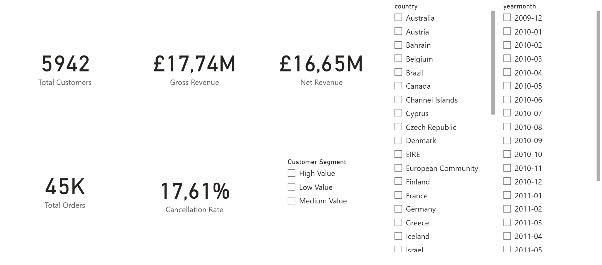
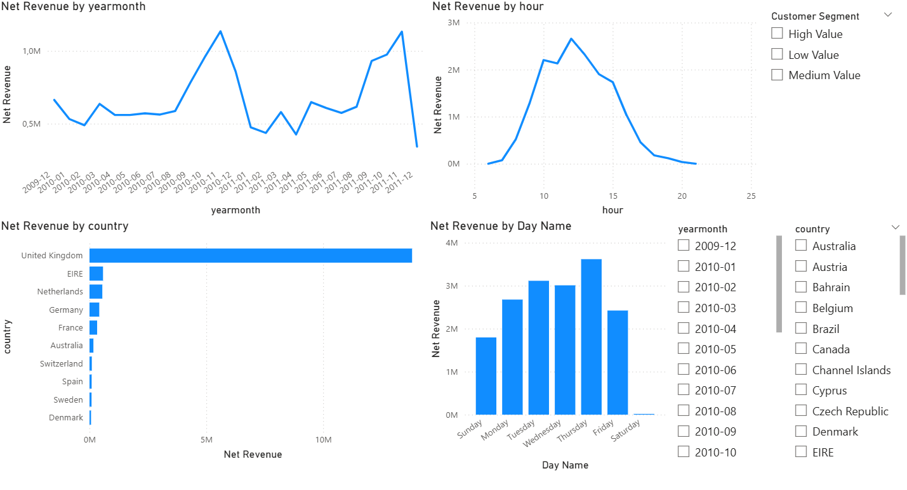
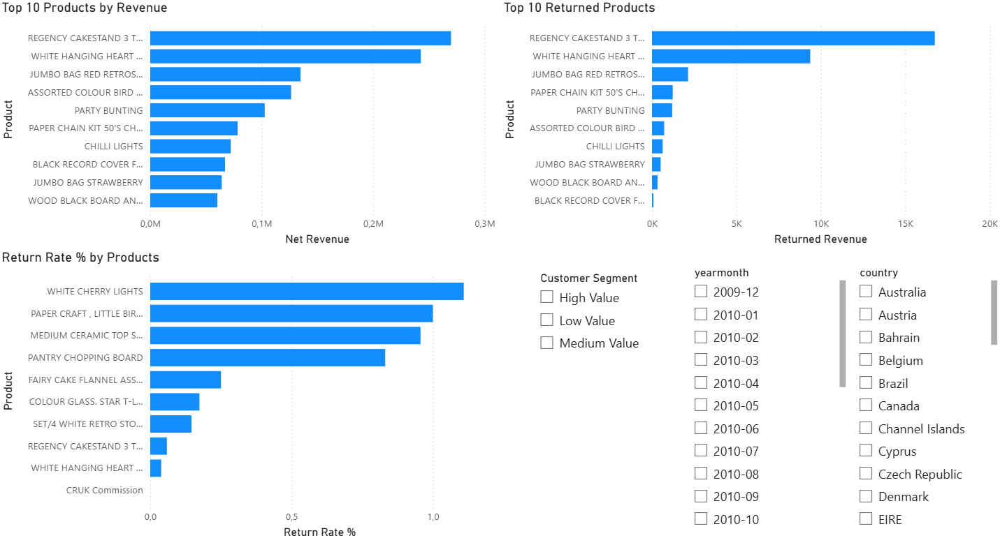
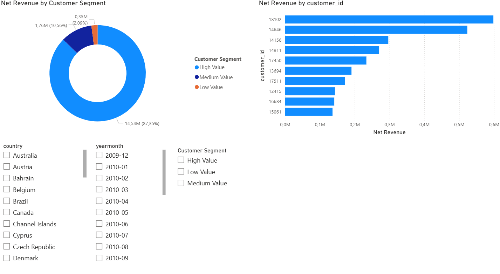

# Sales Performance Intelligence Dashboard

## Opis projektu

Projekt przedstawia analizę wyników sprzedażowych sklepu e-commerce z wykorzystaniem SQL oraz Power BI.

Celem analizy było zidentyfikowanie:
- trendów sprzedażowych,
- zachowań klientów,
- wydajności produktów,
- wzorców zwrotów,
- segmentacji klientów,
- oraz kluczowych insightów biznesowych.

Projekt został zbudowany na rzeczywistym zbiorze danych retail/e-commerce i skupia się na analitycznym oraz biznesowym podejściu do danych, a nie wyłącznie na tworzeniu dashboardów.

---

## Wykorzystane narzędzia

- PostgreSQL
- SQL
- Power BI
- Excel

---

## Pytania biznesowe

Analiza miała odpowiedzieć na następujące pytania:

1. Które produkty generują najwyższy przychód?
2. Które produkty mają najwyższy wskaźnik zwrotów?
3. Jak bardzo skoncentrowany jest przychód klientów?
4. Które kraje generują największy przychód?
5. Jakie trendy sezonowe można zaobserwować w sprzedaży?
6. W jakich godzinach i dniach tygodnia klienci są najbardziej aktywni?
7. Jak duży wpływ na przychód mają anulacje i zwroty?

---

## Kluczowe insighty

### Sprzedaż i sezonowość
- Największy wzrost przychodów występował w okresie Q4.
- Po okresach świątecznych widoczne były znaczące spadki sprzedaży.
- Dane z grudnia 2011 prawdopodobnie są niepełne.

### Analiza klientów
- Przychody są silnie skoncentrowane w grupie klientów wysokiej wartości.
- Relatywnie niewielka grupa klientów generuje większość przychodów.
- Segmentacja klientów ujawniła rozkład zbliżony do zasady Pareto.

### Analiza produktów
- Część najlepiej sprzedających się produktów jednocześnie posiada wysoki poziom zwrotów.
- Wysokie wskaźniki zwrotów mogą sugerować:
  - problemy jakościowe,
  - uszkodzenia podczas dostawy,
  - lub niedopasowanie do oczekiwań klientów.
- Zwroty i anulacje mają istotny wpływ na przychód netto.

### Analiza zachowań użytkowników
- Czwartek generował najwyższy przychód.
- Aktywność klientów osiągała szczyt w godzinach około południowych.
- Sobota charakteryzowała się bardzo niską aktywnością sprzedażową.

---

## Strony dashboardu

### Executive Overview
Ogólny przegląd KPI dotyczących:
- przychodów,
- liczby klientów,
- liczby zamówień,
- oraz poziomu anulacji.

### Revenue Analysis
Analiza:
- miesięcznych trendów przychodów,
- wyników sprzedaży według krajów,
- aktywności klientów według godzin i dni tygodnia.

### Product Analysis
Analiza:
- najlepiej sprzedających się produktów,
- produktów z największą liczbą zwrotów,
- wskaźników zwrotów produktów.

### Customer Analysis
Analiza:
- segmentacji klientów,
- koncentracji przychodów,
- najważniejszych klientów generujących przychód.

---

## Najważniejsze elementy analizy SQL

W projekcie wykorzystano:
- CTE,
- funkcje okienkowe,
- segmentację NTILE,
- analizę przychodów,
- analizę zwrotów,
- analizę klientów,
- kalkulacje KPI.

---

## Podgląd dashboardu

### Executive Overview



---

### Revenue Analysis



---

### Product Analysis



---

### Customer Analysis



---

## Struktura projektu

```text
sales-performance-intelligence-dashboard/
│
├── img/
├── sql/
├── README.md
└── sales_performance_dashboard.pbix
```

---

## Dataset

Źródło danych:
https://archive.ics.uci.edu/ml/datasets/online+retail

---

## Autor

Łukasz Strzegomiak